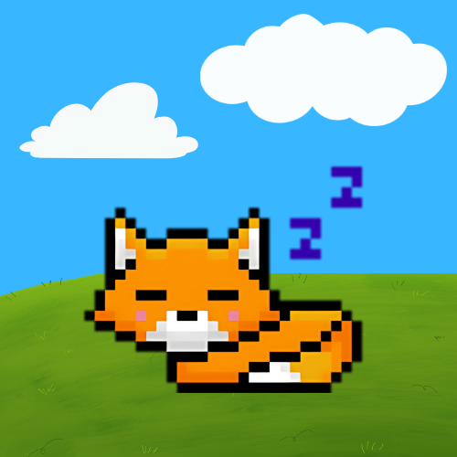

# Your Pet

A friendly desktop fox created with Python and PySide6, designed to bring you some enjoyable moments during your hard-working day.


---

## Features

This desktop pet is more than just an animation; it has a complete lifecycle and several ways to interact with it.

#### Onboarding & Personality
*   **Time-Aware Greetings:** Greets you with "Good morning," "Good afternoon," or "Good evening" when you first launch the app.
*   **Interactive Check-in:** Asks how your day is going and offers a supportive, personalized message based on your answer.

#### Autonomous Behavior
*   **Dynamic Lifecycle:** The fox follows a continuous walk-and-turn cycle to feel alive. It doesn't just sit there!
*   **Intelligent Inactivity:** If left alone for 5 minutes, the fox will go to sleep. Any interaction will wake it up instantly.

#### User Interaction
*   **Cuddle Your Pet:** Hover your mouse back and forth over the fox to show it some love and see a happy "comfy" animation.
*   **Drag and Drop:** Click and hold the left mouse button to pick up the fox and drag it anywhere on your screen. It will show a "shocked" animation and a "post-trauma" recovery sequence when you let go!
*   **Persistent Chat Window:** Open a dedicated chat window to talk with your pet. The conversation history is saved until the app is closed.
*   **System Tray Control:** The application lives in your system tray, giving you persistent control.
    *   **Show / Hide:** Temporarily hide the pet from your screen.
    *   **Talk:** Open the chat window directly.
    *   **Exit:** Safely close the application.

---

## Getting Started

Follow these steps to get your own desktop fox running on your machine.

### Prerequisites
*   Python 3.6 or newer
*   Git command line tools

### Installation

1.  **Clone the repository to your machine:**
    ```bash
    git clone https://github.com/techmoocher/your-pet.git
    ```

2.  **Navigate into the project directory:**
    ```bash
    cd your-pet
    ```

3.  **(Recommended) Create and activate a virtual environment:**
    ```bash
    # For Windows
    python -m venv venv
    .\venv\Scripts\activate

    # For macOS / Linux
    python3 -m venv venv
    source venv/bin/activate
    ```

4.  **Install the required libraries:**
    ```bash
    pip install -r requirements.txt
    ```

5.  **Run the application!**
    ```bash
    python main.py
    ```
    
**ENJOY YOUR NEW FRIEND!!!**

---

## To-Do
*   [ ] Implement visual-only "Feed" and "Drink" actions from the menu.
*   [ ] Add simple sound effects for interactions.
*   [ ] Create a settings window to adjust pet speed or other features.
*   [ ] Expand the non-AI chat with more keyword-based responses.
