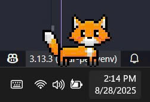

# Your Pet: An Interactive Desktop Companion

A lively desktop fox that brings personality to your screen, complete with a sleek, fully-featured music player to accompany your day.

<!--
<div align="center">
  
</div>
-->
---

## Preview

[]([https://youtube.com/74329Gpg_P4](https://www.youtube.com/watch?v=74329Gpg_P4))

## Features

This application combines a dynamic virtual pet with a modern music player, all controlled from a convenient system tray icon.

### 🦊 The Interactive Fox Pet

The fox is designed with a variety of behaviors to feel like a true companion.

* **Personalized Onboarding:** Greets you according to the time of day and asks how you're feeling. It offers a supportive message based on your mood.
* **Autonomous Behavior:** The fox has a rich lifecycle to make it feel alive. It follows a walk-and-sleep cycle and will randomly:
    * **Pause** to look around.
    * **Wag** its tail happily.
    * **Wonder** which direction to go, thoughtfully turning its head.
* **User Interaction:**
    * **Drag and Drop:** You can pick up the fox and move it anywhere on your screen.
    * **Realistic Reactions:** The fox shows a "shocked" face while being dragged and takes a moment to recover with a "post-trauma" animation after you let it go.
    * **Gentle Pausing:** Clicking and holding the fox without moving it will simply cause it to pause its current action until you release.

### 🎵 The Integrated Music Player

A beautiful and modern music player that runs in the background, fully controllable from the system tray.

* **Sleek, Frameless UI:** A clean, draggable window with a custom dark theme, rounded corners, and a glowing play button.
* **Full Playback Controls:** Features play/pause, next/previous, a draggable progress bar with a dynamic time display (`1:23 / 3:45`), and a volume slider.
* **Playback Modes:** Cycle between **Loop All**, **Loop One**, and **Shuffle** modes using your custom icons.
* **Background Play & Session Saving:** Close the window and the music keeps playing. The app saves your last played song, progress, volume, and playback mode to a `config.json` file, restoring your session on the next launch.
* **System Tray Sub-Menu:** Control your music (play/pause, skip, change loop mode, mute) directly from the tray icon without ever opening the player window.

---

## Getting Started

Follow these steps to get your desktop companion running.

### Prerequisites

* Python 3.7 or newer

### Installation

1.  **Place the Project Folder:** Unzip or place the project folder on your computer.

2.  **Navigate into the project directory using a terminal or command prompt:**
    ```bash
    cd path/to/your-pet-folder
    ```

3.  **(Recommended) Create and activate a virtual environment:**
    ```bash
    # For Windows
    python -m venv venv
    .\venv\Scripts\activate

    # For macOS / Linux
    python3 -m venv venv
    source venv/bin/activate
    ```

4.  **Install the dependencies:**
    ```bash
    pip install -r requirements.txt
    ```

5.  **Run the application!**
    ```bash
    python main.py
    ```

---

## How to Use

### Adding Music

For the music player to find your songs, you must follow this folder structure:

1.  Create a folder named `music` in the same directory as `main.py`.
2.  Inside `music`, create a separate folder for each song. The folder name should be the **song's title** (e.g., `Interstellar-Main-Theme`).
3.  Inside each song folder, place the MP3 file and a thumbnail image.
    * The MP3 file must be named in the format: `Song-Title_Artist-Name.mp3`.
    * The thumbnail must be named: `thumbnail.jpg` (or `.png`, `.jfif`).

**Example Structure:**
```
your-pet/
├── music/
│   └── Interstellar-Main-Theme/
│       ├── Interstellar-Main-Theme_Hans-Zimmer.mp3
│       └── thumbnail.jpg
├── images/
│   └── ... (all the image assets)
├── main.py
└── requirements.txt
```

### Interacting with the Pet

* **Click and drag** the fox to move it.
* **Click and hold** without moving to pause it.
* Use the **system tray icon** to hide/show the fox, control your music, or exit the application.

<!--
---

## To-Do
*   [ ] Implement visual-only "Feed" and "Drink" actions from the menu.
*   [ ] Add simple sound effects for interactions.
*   [ ] Create a settings window to adjust pet speed or other features.
*   [ ] Expand the non-AI chat with more keyword-based responses.
-->
